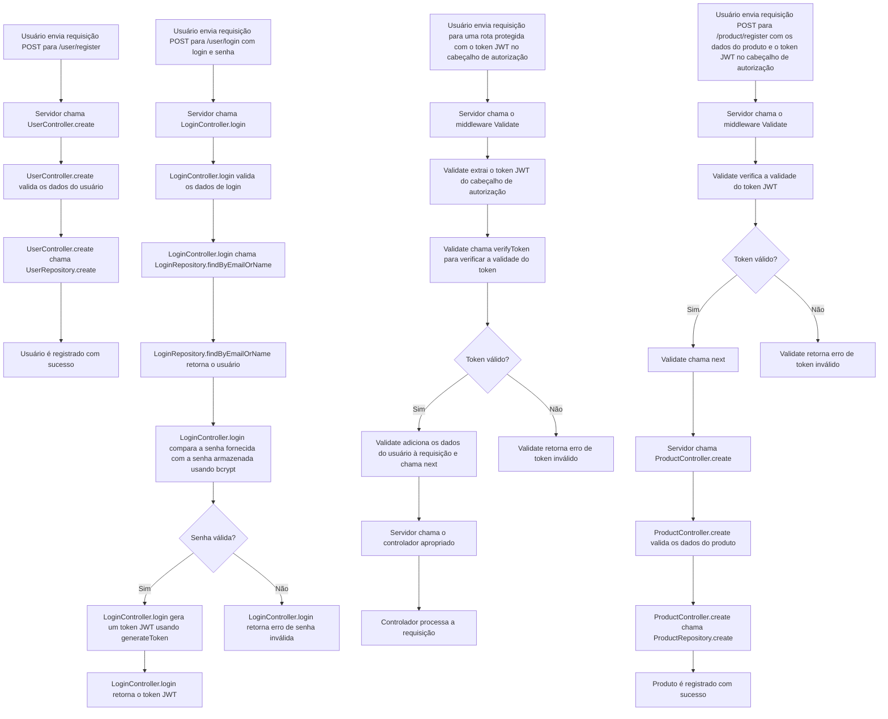

```mermaid
flowchart TD
    %% Fluxo de Registro de Usuário
    A[Usuário envia requisição POST para /user/register] --> B[Servidor chama UserController.create]
    B --> C[UserController.create valida os dados do usuário]
    C --> D[UserController.create chama UserRepository.create]
    D --> E[Usuário é registrado com sucesso]

    %% Fluxo de Login
    F[Usuário envia requisição POST para /user/login com login e senha] --> G[Servidor chama LoginController.login]
    G --> H[LoginController.login valida os dados de login]
    H --> I[LoginController.login chama LoginRepository.findByEmailOrName]
    I --> J[LoginRepository.findByEmailOrName retorna o usuário]
    J --> K[LoginController.login compara a senha fornecida com a senha armazenada usando bcrypt]
    K --> L{Senha válida?}
    L -->|Sim| M[LoginController.login gera um token JWT usando generateToken]
    M --> N[LoginController.login retorna o token JWT]
    L -->|Não| O[LoginController.login retorna erro de senha inválida]

    %% Fluxo de Autenticação para Rotas Protegidas
    P[Usuário envia requisição para uma rota protegida com o token JWT no cabeçalho de autorização] --> Q[Servidor chama o middleware Validate]
    Q --> R[Validate extrai o token JWT do cabeçalho de autorização]
    R --> S[Validate chama verifyToken para verificar a validade do token]
    S --> T{Token válido?}
    T -->|Sim| U[Validate adiciona os dados do usuário à requisição e chama next]
    U --> V[Servidor chama o controlador apropriado]
    V --> W[Controlador processa a requisição]
    T -->|Não| X[Validate retorna erro de token inválido]

    %% Fluxo de Registro de Produto
    Y[Usuário envia requisição POST para /product/register com os dados do produto e o token JWT no cabeçalho de autorização] --> Z[Servidor chama o middleware Validate]
    Z --> AA[Validate verifica a validade do token JWT]
    AA --> AB{Token válido?}
    AB -->|Sim| AC[Validate chama next]
    AC --> AD[Servidor chama ProductController.create]
    AD --> AE[ProductController.create valida os dados do produto]
    AE --> AF[ProductController.create chama ProductRepository.create]
    AF --> AG[Produto é registrado com sucesso]
    AB -->|Não| AH[Validate retorna erro de token inválido]

```
